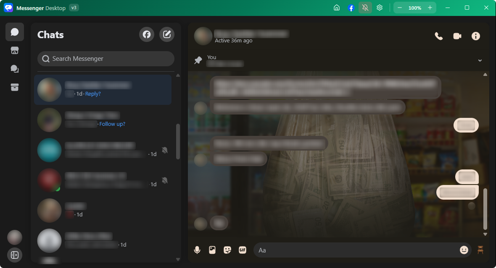
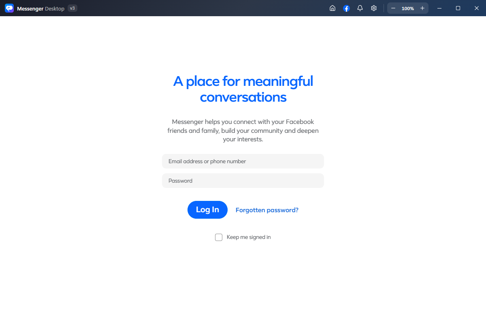
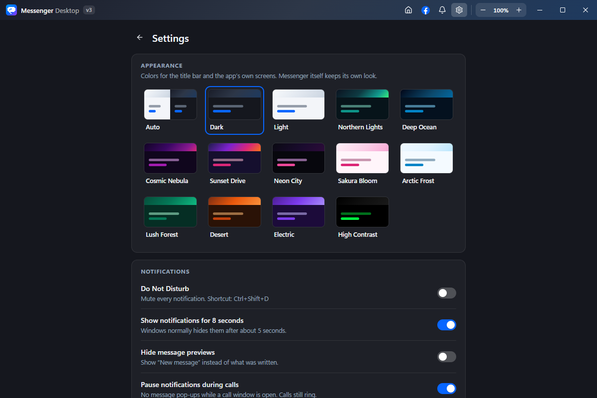
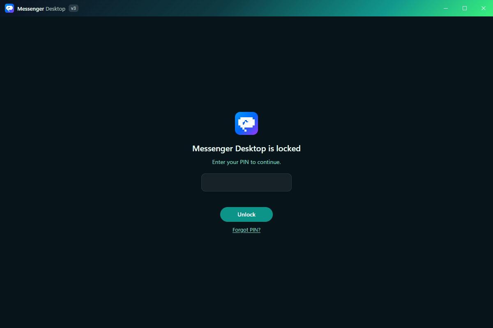
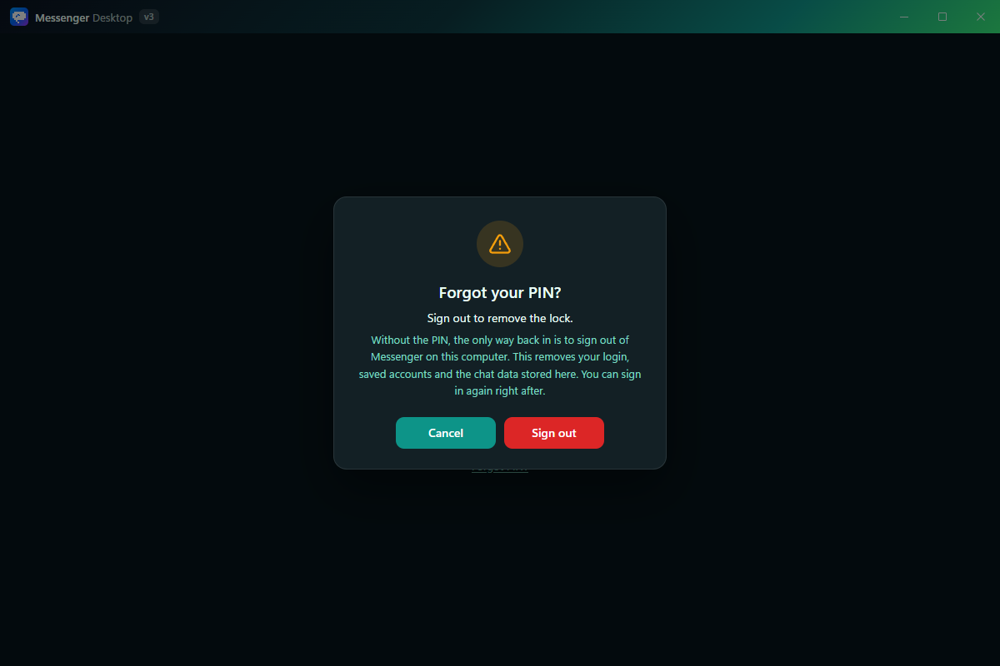
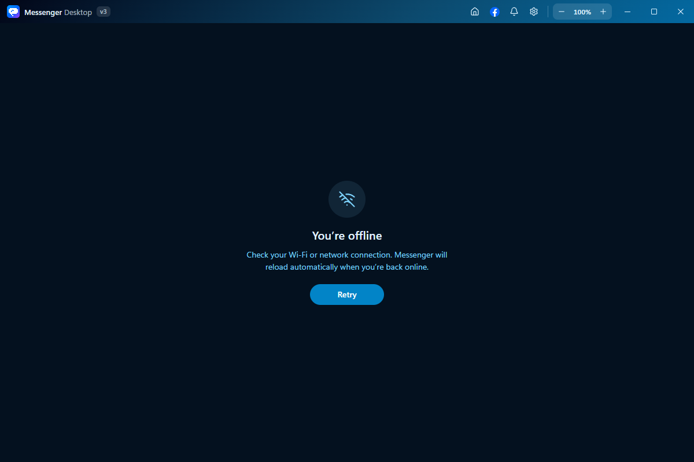
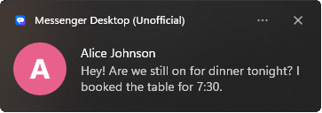
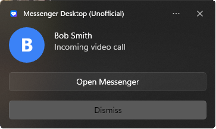

<div align="center">


# Messenger Desktop

**A free, open-source desktop app for Facebook Messenger.**<br>
Rich notifications, an optional PIN lock, 14 themes and a window that stays out of your way.

[](https://github.com/WinTer1165/Messenger-Desktop-Client-Unofficial/releases/latest)
[](https://github.com/WinTer1165/Messenger-Desktop-Client-Unofficial/releases)
[](LICENSE)
[](#download)

**[Website](https://winter1165.github.io/Webpage-for-Messenger-Desktop-Client-Unofficial/)** · **[Download](#download)** · **[What's new](#whats-new-in-v3)** · **[Screenshots](#screenshots)** · **[Features](#features)** · **[FAQ](#faq)** · **[Build from source](#build-from-source)**

<br>



<sub>Unofficial app. Not affiliated with or endorsed by Meta.</sub>

</div>

<br>

## What's new in v3

- **Settings page** inside the window, with a theme picker and **7 new themes**
- **Discord-style notifications** on Windows: the sender's round picture next to their message, and call cards with **Open Messenger** and **Dismiss**
- **App lock** with a PIN, when the app starts, every time you open the window, or after you've been away
- **Offline screen** that reloads Messenger by itself as soon as you're back online
- **Hide message previews** and **pause notifications during calls**
- **Unread dot** on the tray icon
- A cleaner title bar, a centered login page and themed dialogs
- Much lower idle CPU use, and the app's cache no longer grows without limit

<br>

## Download

<table>
  <tr>
    <th width="33%">Windows</th>
    <th width="33%">macOS</th>
    <th width="33%">Linux</th>
  </tr>
  <tr>
    <td align="center" valign="top">
      <br>
      <a href="https://github.com/WinTer1165/Messenger-Desktop-Client-Unofficial/releases/download/v3.0.0/Messenger-Desktop-Unofficial-Setup-3.0.0.exe"></a>
      <br><sub><b>Recommended</b> · updates itself</sub>
      <br><br>
      <a href="https://github.com/WinTer1165/Messenger-Desktop-Client-Unofficial/releases/download/v3.0.0/Messenger-Desktop-Unofficial-3.0.0-Portable-x64.zip"></a>
      <br>
      <a href="https://github.com/WinTer1165/Messenger-Desktop-Client-Unofficial/releases/download/v3.0.0/Messenger-Desktop-Unofficial-3.0.0-Portable-ARM64.zip"></a>
      <br><sub>No install needed</sub>
      <br><br>
    </td>
    <td align="center" valign="top">
      <br>
      <a href="https://github.com/WinTer1165/Messenger-Desktop-Client-Unofficial/releases/download/v3.0.0/Messenger-Desktop-Unofficial-3.0.0-arm64.dmg"></a>
      <br><sub><b>Most Macs</b> from late 2020 on</sub>
      <br><br>
      <a href="https://github.com/WinTer1165/Messenger-Desktop-Client-Unofficial/releases/download/v3.0.0/Messenger-Desktop-Unofficial-3.0.0-x64.dmg"></a>
      <br><sub>Older Intel Macs</sub>
      <br><br>
    </td>
    <td align="center" valign="top">
      <br>
      <a href="https://github.com/WinTer1165/Messenger-Desktop-Client-Unofficial/releases/download/v3.0.0/Messenger-Desktop-Unofficial-3.0.0-x86_64.AppImage"></a>
      <br><sub><b>Any distribution</b> · updates itself</sub>
      <br><br>
      <a href="https://github.com/WinTer1165/Messenger-Desktop-Client-Unofficial/releases/download/v3.0.0/Messenger-Desktop-Unofficial-3.0.0-amd64.deb"></a>
      <br><sub>Debian, Ubuntu, Mint, Pop!_OS</sub>
      <br><br>
      <a href="https://github.com/WinTer1165/Messenger-Desktop-Client-Unofficial/releases/download/v3.0.0/Messenger-Desktop-Unofficial-3.0.0-arm64.AppImage"></a>
      <br><sub>Raspberry Pi and other ARM64</sub>
    </td>
  </tr>
</table>

<p align="center">
  <sub><b>Version 3.0.0</b> · free, no account needed · <a href="https://github.com/WinTer1165/Messenger-Desktop-Client-Unofficial/releases/latest">release notes</a> · <a href="https://github.com/WinTer1165/Messenger-Desktop-Client-Unofficial/releases">older versions</a></sub>
</p>

<details>
<summary><b>Which one do I need?</b></summary>

<br>

- **Windows:** the installer, on any Windows 10 or 11 PC. It works on Intel, AMD and ARM (Snapdragon, Surface Pro X) and keeps itself up to date. Take a portable zip if you can't install apps, for example on a work computer.
- **macOS:** open the Apple menu → **About This Mac**. "Apple M…" means **Apple Silicon**, "Intel" means **Intel**.
- **Linux:** the **.deb** on Debian, Ubuntu, Mint or Pop!\_OS for a normal install with a menu entry. The **AppImage** anywhere else, or if you want one portable file that updates itself.

</details>

<details>
<summary><b>System requirements</b></summary>

<br>

| | Windows | macOS | Linux |
|---|---|---|---|
| **System** | Windows 10 or 11 | macOS 11 Big Sur or newer | Ubuntu 18.04+, Debian 10+, Fedora 32+ or similar |
| **Processor** | x64 or ARM64 | Apple Silicon or Intel | x86_64 or ARM64 |
| **Memory** | 4 GB recommended | 4 GB recommended | 4 GB recommended |
| **Disk space** | 400 MB | 400 MB | 400 MB |

An internet connection is needed for messaging.

</details>

<br>

## Screenshots

<table>
  <tr>
    <td width="50%" valign="top">
      
      <p align="center"><b>Login</b>, centered in any window size</p>
    </td>
    <td width="50%" valign="top">
      
      <p align="center"><b>Settings</b>, with a preview of every theme</p>
    </td>
  </tr>
  <tr>
    <td valign="top">
      
      <p align="center"><b>App lock</b> in the Northern Lights theme</p>
    </td>
    <td valign="top">
      
      <p align="center"><b>Forgot your PIN?</b> signs you out safely</p>
    </td>
  </tr>
  <tr>
    <td valign="top">
      
      <p align="center"><b>Offline screen</b> that reconnects by itself</p>
    </td>
    <td align="center" valign="top">
      <br>
      
      <br><br>
      
      <p align="center"><b>Notifications</b> for messages and calls (Windows)</p>
    </td>
  </tr>
</table>

<br>

## Features

### Notifications

- **Discord-style cards on Windows**: the sender's round picture, their name and message, with the app's name and icon on top
- **Stay on screen for 8 seconds** instead of Windows' usual 5 (can be turned off)
- **Incoming calls** get a call card with **Open Messenger** and **Dismiss** that stays until you act. The window comes forward and the taskbar flashes until you look
- **Hide message previews**: "New message" instead of what was written
- **Pause during calls**: no message pop-ups while a call window is open
- **Do Not Disturb** from the title bar, the tray menu or `Ctrl/Cmd` + `Shift` + `D`
- Clicking a notification brings Messenger to the front

### App lock

An optional PIN for shared computers. Choose when it asks:

- **When the app starts**
- **Every time I open the window**, from the tray or the taskbar
- **After I've been away** for 1, 5, 15, 30 or 60 minutes

It also locks when your computer locks or sleeps (except with "When the app starts"), and you can lock right away from Settings or the tray. While the app is locked, notifications show no names or text. The PIN is stored only as a salted hash, and wrong guesses slow down after a few tries. If you forget it, **Forgot PIN?** signs you out of Messenger on this computer and removes the lock.

> The lock hides Messenger on this computer. It doesn't encrypt your messages.

### Window and tray

- **Custom title bar** with Home, a Facebook button (opens facebook.com in your browser), Do Not Disturb, Settings, zoom and window controls
- **Tray icon** with a red dot while anything is unread, and a count on the Windows taskbar button
- **Minimize to tray** when closing, so notifications keep arriving (Settings → Window & startup)
- **Start with system** on Windows and macOS
- **Offline screen**: start without internet, or right after waking your computer, and the app waits, then reloads Messenger by itself
- **Remembers** its size and position
- External links always open in your default browser

### Themes

Pick one in **Settings → Appearance**. Themes color the title bar, the app's own screens and call windows. Messenger itself keeps its own look.

| | | | |
|---|---|---|---|
| Auto (follows your system) | Dark | Light | Northern Lights |
| Deep Ocean | Cosmic Nebula | Sunset Drive | Neon City |
| Sakura Bloom | Arctic Frost | Lush Forest | Desert |
| Electric | High Contrast | | |

### Keyboard shortcuts

These work everywhere in the window, including while you're typing in Messenger.

| Shortcut | Action |
|---|---|
| `Ctrl/Cmd` + `,` | Open Settings |
| `Ctrl/Cmd` + `+` / `-` / `0` | Zoom in, zoom out, reset zoom |
| `Ctrl/Cmd` + `R` or `F5` | Reload Messenger |
| `Ctrl/Cmd` + `Shift` + `R` | Reload, ignoring the cache |
| `Ctrl/Cmd` + `Shift` + `D` | Toggle Do Not Disturb |
| `Ctrl/Cmd` + `Q` | Quit |

### Calls and screen sharing

Audio and video calls work like on messenger.com, in their own window. Screen sharing lets you pick a whole screen or a single window.

<br>

## Installation

<details>
<summary><b>Windows</b></summary>

<br>

**Installer**

1. Download the [installer](https://github.com/WinTer1165/Messenger-Desktop-Client-Unofficial/releases/download/v3.0.0/Messenger-Desktop-Unofficial-Setup-3.0.0.exe) and run it.
2. If Windows shows **"Windows protected your PC"**, click **More info**, then **Run anyway**. The app is open source but not code-signed, which costs several hundred dollars a year.
3. Follow the installer. The app opens when it's done and updates itself from then on.

**Portable**

1. Download the zip for your processor (x64 or ARM64) and extract it anywhere, for example `C:\Apps\Messenger`.
2. Run `Messenger Desktop (Unofficial).exe`.

Portable copies don't create Start Menu entries and don't update themselves.

</details>

<details>
<summary><b>macOS</b></summary>

<br>

1. Download the `.dmg` for your Mac (Apple menu → **About This Mac**: "Apple M…" means Apple Silicon, "Intel" means Intel).
2. Open it and drag **Messenger Desktop (Unofficial)** into **Applications**.
3. The app isn't notarized by Apple, so the first launch is blocked. Right-click the app → **Open** → **Open**, or run this once in Terminal:

   ```bash
   xattr -cr "/Applications/Messenger Desktop (Unofficial).app"
   ```

</details>

<details>
<summary><b>Linux</b></summary>

<br>

**AppImage** (any distribution)

```bash
chmod +x Messenger-Desktop-Unofficial-3.0.0-x86_64.AppImage
./Messenger-Desktop-Unofficial-3.0.0-x86_64.AppImage
```

On Ubuntu 22.04 and newer you may need `sudo apt install libfuse2` first. [AppImageLauncher](https://github.com/TheAssassin/AppImageLauncher) adds it to your app menu.

**Debian package** (Debian, Ubuntu, Mint, Pop!\_OS)

```bash
sudo apt install ./Messenger-Desktop-Unofficial-3.0.0-amd64.deb
```

Remove it later with `sudo apt remove messenger-desktop-unofficial`.

</details>

<details>
<summary><b>First login</b></summary>

<br>

The app opens Messenger's own login page. Your email and password go straight to Facebook; the app never sees or stores them. It keeps only the login session, like a browser does, so you stay signed in next time.

</details>

<br>

## Privacy and security

- **Open source**: every line of code is on GitHub.
- **No tracking**: the app talks to Facebook, and to GitHub to check for updates. Nothing else.
- **Sandboxed**: messenger.com runs isolated from your computer, with no access to your files or system.
- **Your login stays with Facebook**: the login page is Facebook's own.
- **Stays in the app**: only Messenger and Facebook load inside the window; every other link opens in your browser.

What the app stores on your computer:

| | |
|---|---|
| **Settings** | Your theme and preferences, plus the app lock PIN as a salted hash only |
| **Window state** | Size and position |
| **Messenger session** | Your login and Messenger's own cache, like a browser profile |

It lives in `%APPDATA%\messenger-desktop-unofficial` on Windows, `~/Library/Application Support/messenger-desktop-unofficial` on macOS and `~/.config/messenger-desktop-unofficial` on Linux.

Found a security issue? Please don't open a public issue. See the [Security Policy](SECURITY.md).

<br>

## FAQ

<details>
<summary><b>Is this safe to use?</b></summary>

<br>

Yes. The code is open for anyone to read, the app collects no data, and your password goes straight to Facebook. Messenger runs in a sandbox, exactly like in a browser tab.

</details>

<details>
<summary><b>Do I need to log in every time?</b></summary>

<br>

No. After your first login the app remembers your session until you log out. Tick **Keep me signed in** on the login page to stay signed in across restarts.

</details>

<details>
<summary><b>Why do notifications look different on macOS and Linux?</b></summary>

<br>

The Discord-style cards use Windows' notification layout. macOS and Linux show your system's standard notifications, with the same Do Not Disturb, hidden previews and call handling. macOS decides itself how long a banner stays up.

</details>

<details>
<summary><b>What happens if I forget my app lock PIN?</b></summary>

<br>

Click **Forgot PIN?** on the lock screen. After you confirm, the app signs you out of Messenger on this computer, removes the lock and takes you to the login page. Your account itself is untouched; just sign in again.

</details>

<details>
<summary><b>Can I use more than one account?</b></summary>

<br>

Not yet. Log out and back in to switch accounts.

</details>

<details>
<summary><b>How do I update?</b></summary>

<br>

The Windows installer and the Linux AppImage check for updates by themselves and ask you to restart when one is ready. You can also check from **Settings → About** or the tray menu. On macOS, and for portable copies and the `.deb`, download the new version from the [Releases page](https://github.com/WinTer1165/Messenger-Desktop-Client-Unofficial/releases/latest).

</details>

<details>
<summary><b>How do I uninstall?</b></summary>

<br>

- **Windows:** Settings → Apps → Messenger Desktop (Unofficial) → Uninstall
- **macOS:** drag the app from Applications to the Trash
- **Linux:** delete the AppImage, or `sudo apt remove messenger-desktop-unofficial`

</details>

<br>

## Troubleshooting

<details>
<summary><b>Notifications don't show up</b></summary>

<br>

1. Make sure Do Not Disturb is off (the bell in the title bar).
2. On Windows, open Settings → System → Notifications and make sure **Messenger Desktop (Unofficial)** is allowed, and that Windows' own Do Not Disturb or Focus is off.
3. If they disappear too fast or stay too long, toggle **Show notifications for 8 seconds** in Settings → Notifications.

</details>

<details>
<summary><b>The login page won't load</b></summary>

<br>

1. Check your connection. If you're offline, the app shows its offline screen and reloads Messenger once you're back.
2. Check that facebook.com opens in your browser; some work or school networks block it.
3. Press `Ctrl` + `Shift` + `R` to reload without the cache.

</details>

<details>
<summary><b>Camera, microphone or screen sharing doesn't work</b></summary>

<br>

1. On Windows, open Settings → Privacy & security → Camera and Microphone, and allow desktop apps.
2. On macOS, allow the app under System Settings → Privacy & Security.
3. For screen sharing, try sharing a single window instead of the whole screen.

</details>

<details>
<summary><b>The app won't start</b></summary>

<br>

1. Check that it isn't already running in the tray.
2. Restart your computer.
3. Reinstall the latest version from the [Releases page](https://github.com/WinTer1165/Messenger-Desktop-Client-Unofficial/releases/latest).

</details>

Still stuck? [Open an issue](https://github.com/WinTer1165/Messenger-Desktop-Client-Unofficial/issues) with what happened, what you tried and a screenshot if you can.

<br>

## Build from source

You need [Node.js](https://nodejs.org/) 24 or newer.

```bash
git clone https://github.com/WinTer1165/Messenger-Desktop-Client-Unofficial.git
cd Messenger-Desktop-Client-Unofficial
npm install

npm run dev          # build and run
npm test             # typecheck and lint

npm run dist:win     # Windows installer (x64 + ARM64)
npm run dist:mac     # macOS .dmg (Apple Silicon and Intel)
npm run dist:linux   # Linux AppImage (x86_64, ARM64) and .deb
```

Each platform's packages have to be built on that platform. Published releases are built by GitHub Actions on all three.

<br>

## Contributing

Contributions are welcome. Read the [Contributing Guidelines](CONTRIBUTING.md) for the setup, project structure and the security rules pull requests need to follow, and please follow the [Code of Conduct](CODE_OF_CONDUCT.md).

1. Fork the repository and create a branch
2. Make your change and run `npm test`
3. Open a pull request

<br>

## License

[MIT](LICENSE). Built with [Electron](https://www.electronjs.org/).

Messenger Desktop is an unofficial app and is not affiliated with, endorsed by or connected to Meta Platforms, Inc. Messenger and Facebook are trademarks of Meta Platforms, Inc.
